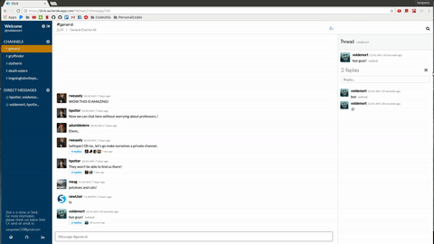
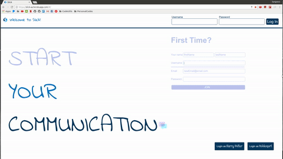
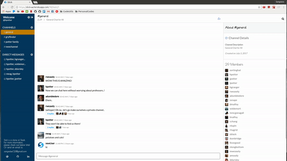
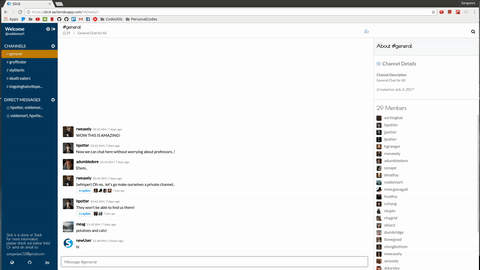
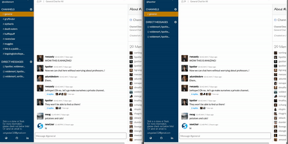
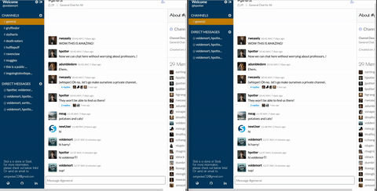
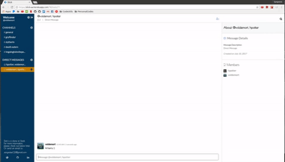
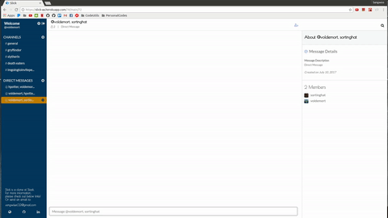

# Slick

[LIVE](https://slick-aa.herokuapp.com/#/)

Slick is a web application inspired by a well-known communication app, Slack. While maintaining all of Slack's basic functionalities such as live chatting system and the flexibilities of chatting group, to it, certain personal flavors in colors, fonts, designs, and extra utilities were added.

## Features and implementation

To provide most sensible explanation of what Slick is capable of, its features  will be described in the following order:
1. [Users](#users)
2. [Channels and Subscriptions](#channels-and-subscriptions)
3. [Messages](#messages)
4. [Live Chat](#live-chat)
5. [Notifications](#notifications)
6. [Other notable features](#other-notable-features)

## Users

  
  

Slick allows user to create, read, update its information. Creation of users are done in the frontpage, where new users are invited to join the app.
Once signed up or logged in, user can update their profile information (firstname, lastname, email, picture) in the edit section of the app.

## Channels and Subscriptions

  
  

Channels & Subscriptions can be created, read, and destroyed. Updating channel information has been intentionally left out to ensure that the choices of
name and descriptions are carefully chosen at their creation.

There are three types of channels in Slick - private, public, and Direct Message. The difference between private and public is that all users can see public chat,
 but they cannot see private chats. Then, the difference between private chats and direct messages is that users do not have to go through naming and describing them.

Channels can be created at the left channel navigation of the application. Once initiated, creator of the channel are welcomed to invite any other users available in the app.
Lastly, direct messages can be created similar to private & public channels, or the user can simply click the list of participants in the right column of the app.

## Messages

  
  

Messages are created when the user submits content in the most bottom part of middle column. Upon submitting, the message will be displayed in the main message content.
After the message has been created, author is able to delete and update the messages within the postings.
Users may also reply to existing messages. Replies are designed with polymorphic and self association to messages.

## Live Chat

  
  

Live chat is not an option for any chat application. Slick users pusher api to establish connection between all users of the app.
There are three events that happen in real time, which are:

1. Messaging
2. Channel Invitations
3. Participant changes

## Notifications

Going hand to hand with live chat functionality, user can also experience notifications during these events.
Bottom left space has been purposely left out to allow users to see any notifications during their navigation around the app.
Users will receive following notifications:

1. Message from other user in the other channel
2. Joining of channel
3. Successful profile update
4. Attempt for invalid modifications

## Other Notable Features

There are few noteworthy features in Slick.
1. Inviting other users to created channel
2. Joining a public channel

## Future Directions for the Project

As for future directions, following are desired features for Slick:

1. Persisting emoticon data
2. Creation of replies
3. Addition of giphy support
